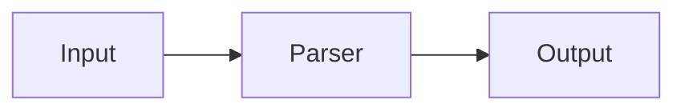
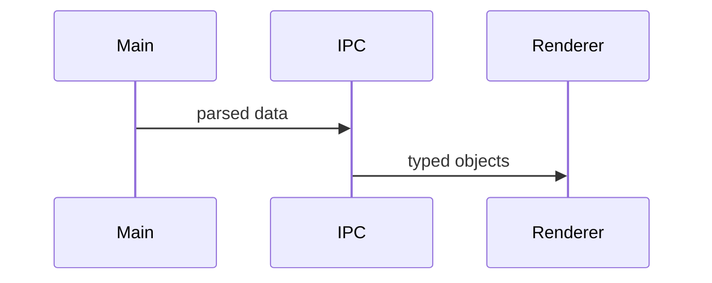
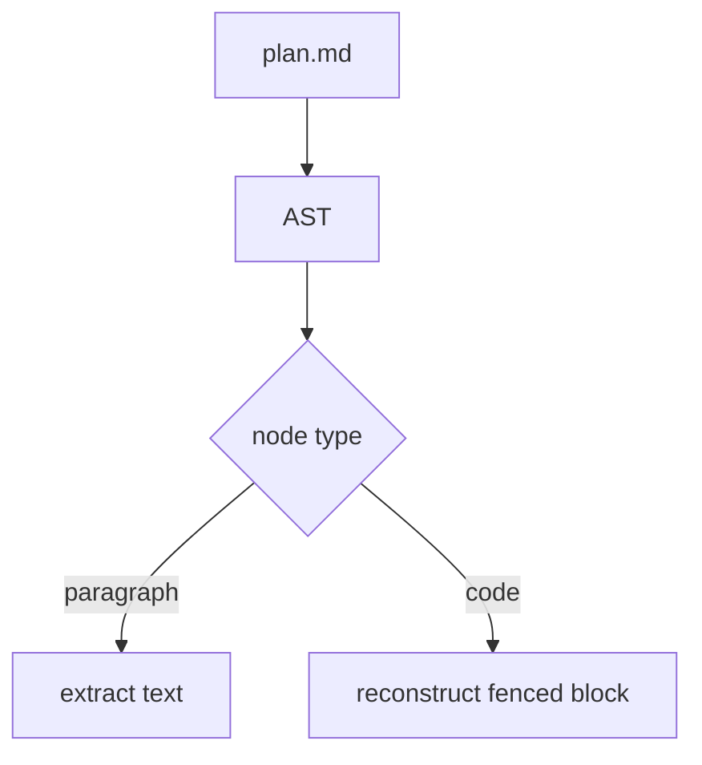

# Implementation Plan: Diagram Test Feature

**Branch**: `004-diagram-test` | **Date**: 2026-03-26 | **Spec**: [spec.md](./spec.md)

## Summary

This plan tests code block preservation in the parser. The system processes data through multiple stages.



## Technical Approach

The feature uses TypeScript 5.x with React 19. Data flows from the main process through IPC to the renderer.



The renderer then displays the structured content using React components.

```typescript
function processData(input: string): ParseResult {
  const tree = parseMarkdown(input);
  return extractSections(tree);
}
```

## Constitution Check

All principles pass. No violations.

## Architecture Decisions

### 1. Parser preserves code blocks

**Decision**: Add code node handling alongside paragraph extraction.

**Rationale**: Without this fix, diagrams are silently dropped. Here is the data flow:



**Alternatives rejected**: Raw string slicing — too risky for structured field parsing.

### 2. Template guidance conventions

**Decision**: Follow summary template diagram conventions.

**Rationale**: Consistency across templates. No diagrams needed for this text-only decision.

**Alternatives rejected**: Separate shared guide document — adds indirection.

## Project Structure

### Files modified

```text
src/main/parser/plan-parser.ts
.claude/specify/templates/plan-template.md
tests/unit/parser/plan-parser.test.ts
```
